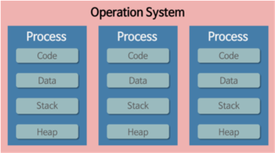
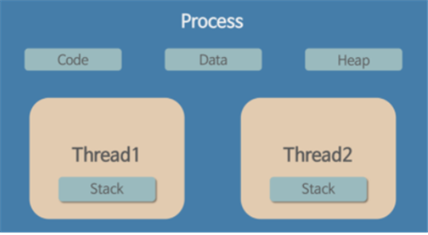

## 💻 프로세스

### 정의
- 컴퓨터에서 연속적으로 실행되고 있는 컴퓨터 프로그램
- 메모리에 올라와 실행되고 있는 프로그램 인스턴스
- 운영체제로부터 시스템 자원을 할당받는 작업의 단위
### 특징
- `Code`, `Data`, `Stack`, `Heap`의 구조로 되어 있는 독립된 메모리 영역을 가짐
- 프로세스당 최소 1개의 메인스레드를 가지고 있음\
- 각 프로세스는 별도의 주소 공간에서 실행되며, 한 프로세스는 다른 프로세스의 변수나 자료구조에 접근할 수 없음
- 한 프로세스가 다른 프로세스의 자원에 접근하려면 프로세스 간의 통신 (IPC, inter-process communication)을 사용하거나 파이프, 파일, 소켓 등을 이용하여 통신 해야 함
### 프로세스의 메모리 구조
- **프로세스의 메모리는 `Code`, `Data`, Heap`, `Stack` 영역으로 나누어져 있으며 이들을 가각 `Segment`라고 부름**
- ✔️ **Code 영억**
     - 정적 세그먼트
     - 컴파일 타임에 결정됨
     - 사용자가 작성한 프로그램 함수들의 코드가 CPU에서 수행할 수 있는 기계어 형태로 변환되어 저장되는 공간
     - 작성한 코드가 들어가는 부분 (기계어 포함)
     - 이 영역은 `read only`영역이라 쓰기 작업이 들어오면 `access violation`이 발생
     - 프로세스가 종료될 때까지 계속 유지되는 영역
 - ✔️ **Data 영역**
     - 정적 세그먼트
     - 전역변수, 정적변수, 배열, 구조체 등이 저장됨
     - 초기화 된 데이터가 저장됨
     - 프로세스 종료까지 유지되며 함수 내 변수들은 여기에 해당하지 않음
- ✔️ **Heap 영역**
    - 동적 세그먼트
    - `new`로 생성한 객체들이 저장되는 영역
    - `gc의 대상이 되는 영역`
- ✔️ **Stack 영역**
    - 지역변수, 매개변수, 복귀 번지 등이 저장되어 있는 영역
    - 프로그램이 자동으로 사용하는 임시 메모리
    - 함수 호출 시 생성되고, 함수 종료시 반환 

## 🖥️ 쓰레드

### 정의
- `프로세스`내에서 실행되는 여러 흐름의 단위
- 프로세스의 특정한 수행 경로
- 프로세스가 할당받은 자원을 이용하는 실행의 단위
### 특징
- 쓰레드는 프로세스 내에서 각각 `Stack`만 따로 할당받고 Code, Data, Heap 영역은 공유함
- 쓰레드는 한 프로세스 내에서 동작되는 여러 실행 흐름으로, 프로세스 내의 주소 공간이나 자원들을 같은 프로세스 내에 쓰레드끼리 공유하면서 실행됨
- 각각의 쓰레드는 별도의 레지스터와 스택을 가지고 있지만, Heap 메모리는 서로 읽고 쓸 수 있음
- 자원을 공유하기 때문에 멀티 쓰레드 환경에서 필연적으로 동기화 이슈가 발생할 수 있음
- Thread Safe를 고려하여 개발 해야함
   